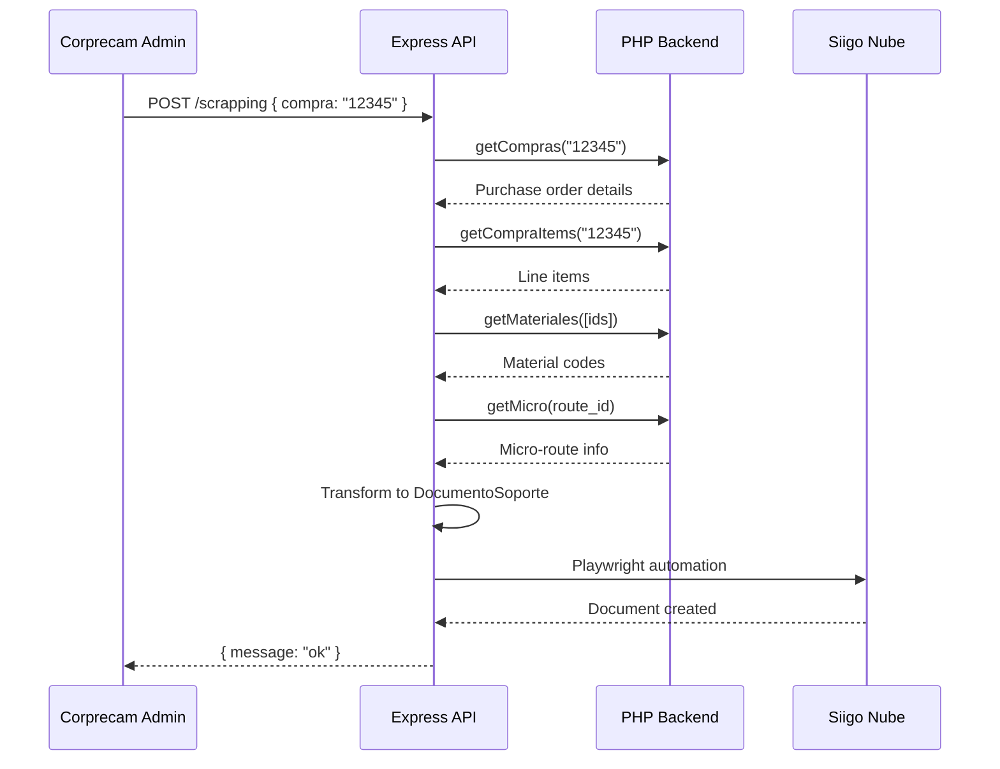

## What is Siigo Corprecam Scraper?

Siigo Corprecam Scraper is an automated web scraping solution that integrates purchase order data from the Corprecam administrative system with Siigo accounting software. It uses Playwright to automate the creation of support documents (Documento Soporte) in Siigo Nube, eliminating manual data entry for purchase transactions.

## Why It Exists

Manually entering purchase order data into Siigo is time-consuming and error-prone. For organizations like Corprecam and Reciclemos that process multiple purchase orders daily, this automation:

- **Saves Time**: Eliminates manual data entry for each purchase order line item
- **Reduces Errors**: Automated field population ensures accurate product codes, quantities, and prices
- **Ensures Consistency**: Applies standardized warehouse and account settings across all transactions
- **Improves Traceability**: Direct integration between purchase orders and accounting documents

## How It Works

The scraper follows a multi-step workflow:

<Steps>
  <Step title="Receive Purchase Order">
    The Express API receives a POST request with a purchase order code (`compra`)
  </Step>
  
  <Step title="Fetch Related Data">
    The system retrieves:
    - Purchase order details (com_codigo, comp_asociado, com_micro_ruta)
    - Purchase items with quantities and prices
    - Material codes and descriptions
    - Micro-route information
  </Step>
  
  <Step title="Transform Data">
    Purchase items are categorized by company:
    - **Corprecam** (emp_id_fk = 1): Uses NIT 900142913
    - **Reciclemos** (emp_id_fk = 2): Uses NIT 901328575
  </Step>
  
  <Step title="Automate Siigo Entry">
    Playwright launches Firefox and:
    - Logs into Siigo Nube with credentials
    - Creates a new Documento Soporte
    - Fills in supplier, document type, and consecutive number
    - Adds each product line with code, quantity, and price
    - Selects the appropriate warehouse and payment account
  </Step>
</Steps>

## Key Features

### Dual Company Support

The scraper handles purchase orders for both Corprecam and Reciclemos, applying company-specific configurations:

```typescript
if (documentoSoporte.corprecam.length > 0) {
  await playwright_corprecam_reciclemos(
    documentoSoporte.corprecam,
    documentoSoporteLabelCode,
    bodegaRiohacha,
    "CAJA RIOHACHA",
    documentoSoporte.proveedor_id,
    config.USER_SIIGO_CORPRECAM,
    config.PASSWORD_SIIGO_CORPRECAM,
    "900142913" // Corprecam NIT
  );
}

if (documentoSoporte.reciclemos.length > 0) {
  await playwright_corprecam_reciclemos(
    documentoSoporte.reciclemos,
    documentoSoporteLabelCode,
    bodegaRiohacha,
    "Efectivo",
    documentoSoporte.proveedor_id,
    config.USER_SIIGO_CORPRECAM,
    config.PASSWORD_SIIGO_CORPRECAM,
    "901328575" // Reciclemos NIT
  );
}
```

### Retry Logic

All Playwright operations use retry-until-success patterns to handle Siigo's dynamic Angular-based UI:

```typescript
await retryUntilSuccess(
  async () => {
    const input = page.locator("#trEditRow #editProduct #autocomplete_autocompleteInput");
    await input.click();
    await input.pressSequentially(codigo, { delay: 150 });
    await page.locator(".siigo-ac-table tr").first().waitFor();
    await page.locator(".siigo-ac-table tr", {
      has: page.locator(`div:text-is("${codigo}")`)
    }).first().click();
  },
  { label: "selección de producto" }
);
```

### Ngrok Integration

The server automatically exposes itself via Ngrok and registers the public URL with the Corprecam system:

```typescript
const listener = await ngrok.forward({
  addr: 3000,
  authtoken: config.NGROK_AUTHTOKEN,
});

await setNgrok(listener.url());
```

This allows the Corprecam administrative panel to trigger the scraper remotely.

## Architecture

### API Layer (`server.ts`)

Express server that exposes the `/scrapping` endpoint and handles Ngrok tunneling.

### Business Logic (`main.ts`)

Orchestrates the scraping workflow, determining which company configurations to apply.

### Data Transformation (`utils/transformDs.ts`)

Converts database records into the DocumentoSoporte format, splitting products by company.

### Playwright Automation (`utils/functions.ts`)

Contains all browser automation logic: login, product selection, form filling, and submission.

### External API Integration (`api/php.ts`)

Fetches purchase order data from the Corprecam administrative backend.

## Data Flow



## Technology Stack

- **Runtime**: Node.js with TypeScript
- **Web Automation**: Playwright (Firefox)
- **API Framework**: Express 5.x
- **Database**: MySQL 2 (for external API integration)
- **Tunneling**: Ngrok
- **Environment Management**: dotenv

## Next Steps

<CardGroup cols={2}>
  <Card title="Quick Start" icon="rocket" href="/quickstart">
    Get the scraper running in under 5 minutes
  </Card>
  <Card title="Configuration" icon="gear" href="/configuration">
    Learn about environment variables and settings
  </Card>
  <Card title="API Reference" icon="code" href="/api/endpoints">
    Explore the /scrapping endpoint
  </Card>
  <Card title="Troubleshooting" icon="wrench" href="/troubleshooting/common-issues">
    Common issues and solutions
  </Card>
</CardGroup>